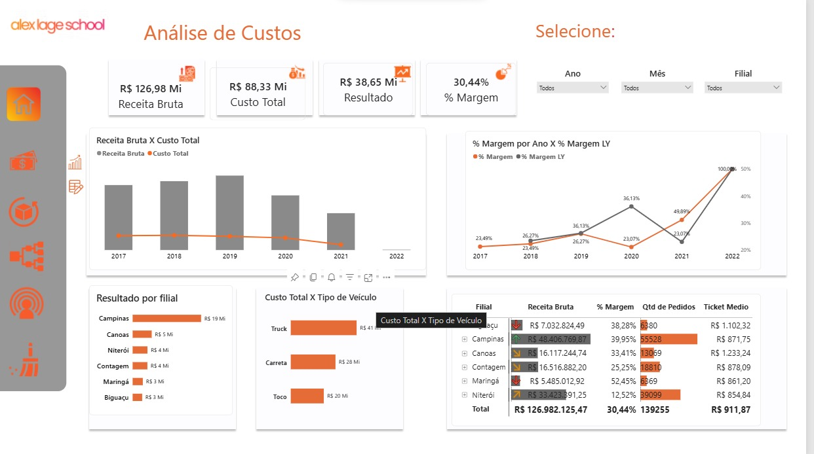
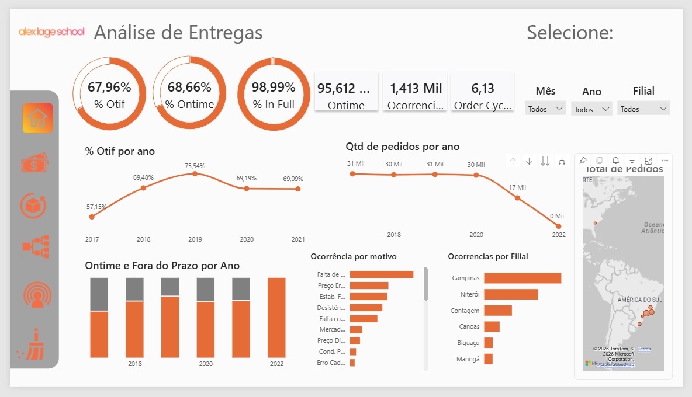
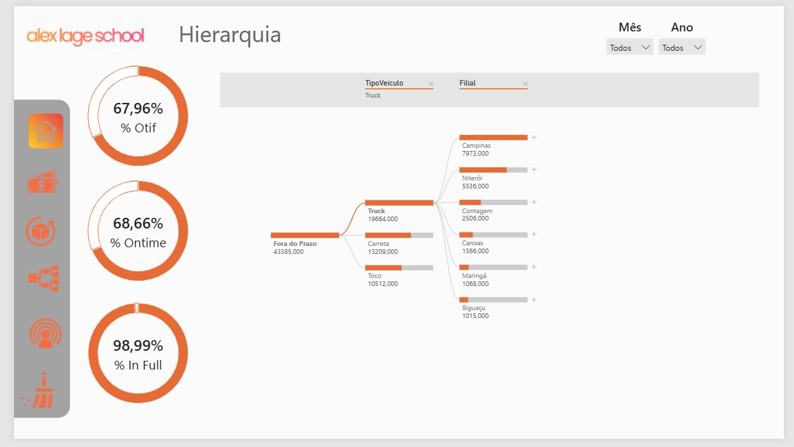
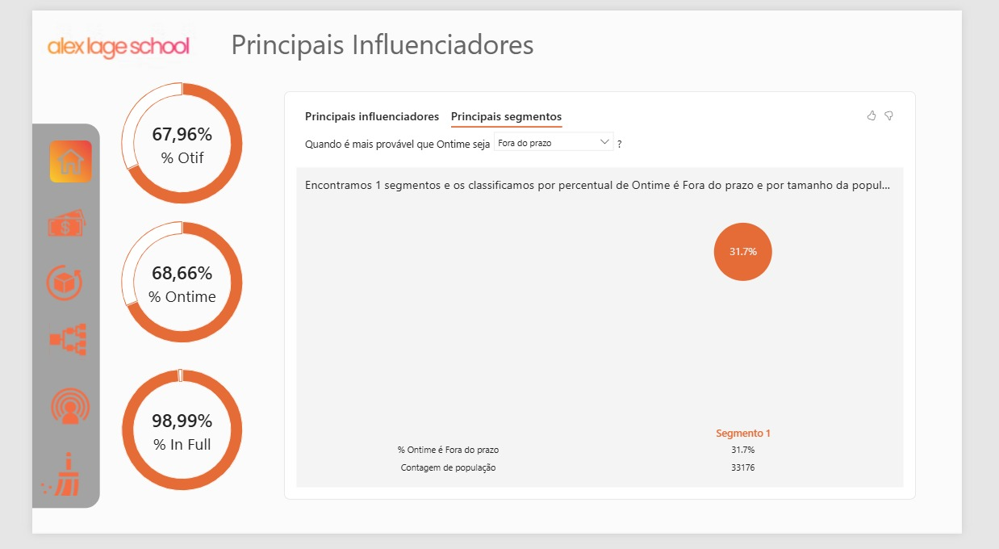

# Dashboard de Análise Logística

Dashboard desenvolvido em Power BI durante minha formação em Análise de Dados, com foco na análise de indicadores financeiros, operacionais e de desempenho logístico.

O projeto utiliza dados simulados para representar um cenário empresarial e permitir a análise de receita, custos, margem, entregas, pedidos e ocorrências, apoiando a interpretação dos dados e a identificação de pontos de atenção.

---

## Objetivo do projeto

Construir um dashboard interativo capaz de consolidar diferentes indicadores da operação logística em uma única solução de análise, permitindo explorar os dados por período, filial e tipo de veículo.

O projeto foi desenvolvido com foco em:

- acompanhamento de indicadores financeiros;
- análise de custos e margem;
- avaliação da performance das entregas;
- análise de pedidos e ocorrências;
- comparação entre filiais;
- análise por tipo de veículo;
- exploração de fatores relacionados ao desempenho de entregas.

---

## Principais análises

### Análise de custos e resultados

A primeira visão do dashboard apresenta indicadores financeiros e permite analisar:

- Receita Bruta;
- Custo Total;
- Resultado;
- % Margem;
- Receita Bruta x Custo Total por ano;
- Resultado por filial;
- Custo Total por tipo de veículo;
- % Margem por ano x % Margem LY;
- Receita, margem, quantidade de pedidos e ticket médio por filial.

Na visão apresentada no projeto, os principais indicadores consolidados são:

| Indicador | Valor |
|---|---:|
| Receita Bruta | R$ 126,98 Mi |
| Custo Total | R$ 88,33 Mi |
| Resultado | R$ 38,65 Mi |
| % Margem | 30,44% |
| Quantidade de Pedidos | 139.255 |
| Ticket Médio | R$ 911,87 |

Fonte: dados simulados utilizados no projeto.

---

### Análise de entregas

A segunda visão concentra indicadores relacionados à performance das entregas.

Principais indicadores:

- OTIF;
- On Time;
- In Full;
- Order Cycle;
- Ocorrências;
- Pedidos por ano;
- Entregas no prazo e fora do prazo;
- Ocorrências por motivo;
- Ocorrências por filial.

Indicadores apresentados no projeto:

| Indicador | Valor |
|---|---:|
| % OTIF | 67,96% |
| % On Time | 68,66% |
| % In Full | 98,99% |
| Order Cycle | 6,13 |
| Ocorrências | 1,413 Mi |

---

### Análise hierárquica

O dashboard também apresenta uma análise hierárquica que permite explorar os indicadores a partir de diferentes níveis de detalhamento.

A navegação possibilita analisar a relação entre:

**Tipo de Veículo → Filial**

Essa estrutura permite aprofundar a análise e observar como diferentes categorias de veículos e filiais contribuem para os resultados apresentados.

---

### Principais influenciadores

Foi utilizada a visualização de **Principais Influenciadores** do Power BI para investigar fatores relacionados ao desempenho de On Time.

A análise apresentada identifica segmentos associados ao indicador de entregas fora do prazo e permite explorar possíveis padrões nos dados.

---

## Principais KPIs

O projeto trabalha com indicadores importantes para análise logística e financeira, entre eles:

- Receita Bruta;
- Custo Total;
- Resultado;
- Margem;
- Ticket Médio;
- Quantidade de Pedidos;
- OTIF;
- On Time;
- In Full;
- Order Cycle;
- Ocorrências.

---

## Tecnologias utilizadas

### Business Intelligence
- Power BI

### Linguagem de análise
- DAX

### Preparação e transformação de dados
- Power Query

### Modelagem
- Modelagem de Dados
- Tabela Calendário
- Relacionamentos entre tabelas
- Cardinalidade
- Direção de filtro
- Tabela de Medidas

### Design e UX
- Figma

---

## Modelagem e tratamento dos dados

Durante o desenvolvimento do projeto foram aplicados conceitos de modelagem e preparação de dados no Power BI.

Entre os recursos utilizados estão:

- criação de Tabela Calendário;
- definição de relacionamentos entre tabelas;
- análise de cardinalidade;
- configuração da direção de filtro;
- criação e organização de uma Tabela de Medidas;
- tratamento e transformação de dados com Power Query;
- criação de medidas utilizando DAX.

---

## DAX e indicadores

Foram desenvolvidas medidas em DAX para construção dos indicadores e análises do dashboard.

Os cálculos foram utilizados para apoiar indicadores financeiros e operacionais, incluindo margem, receita, custos, pedidos e indicadores de desempenho logístico.

---

## Interatividade e experiência do usuário

O dashboard foi desenvolvido buscando facilitar a navegação e a exploração dos dados.

Foram utilizados:

- filtros por ano;
- filtros por mês;
- filtros por filial;
- filtros por tipo de veículo;
- botões de navegação;
- Tooltips personalizados;
- gráficos interativos;
- cartões de indicadores;
- tabelas analíticas;
- visualização de Principais Influenciadores;
- análise hierárquica.

---

## Demonstração

### Visão geral e análise de custos

A página inicial apresenta os principais indicadores financeiros e análises de receita, custos, resultado e margem.

### Análise de entregas

Visão dedicada ao acompanhamento da performance das entregas, incluindo OTIF, On Time, In Full, pedidos, ocorrências e Order Cycle.

### Análise hierárquica

Visualização para exploração dos dados por tipo de veículo e filial.

### Principais influenciadores

Análise exploratória utilizando o recurso de Principais Influenciadores do Power BI.

---

## Principais aprendizados

O desenvolvimento deste projeto permitiu aplicar, na prática:

- modelagem de dados no Power BI;
- criação de medidas em DAX;
- preparação de dados com Power Query;
- construção de KPIs;
- criação de dashboards interativos;
- análise de indicadores financeiros e operacionais;
- criação de análises hierárquicas;
- utilização de Tooltips;
- utilização de Principais Influenciadores;
- organização visual e aplicação de conceitos de UX;
- criação de uma identidade visual para o dashboard.

---

## Resultado

O projeto resultou em um dashboard interativo capaz de reunir indicadores financeiros e logísticos em diferentes perspectivas de análise.

A solução permite explorar os dados por período, filial e tipo de veículo, facilitando a interpretação dos indicadores e a identificação de padrões e pontos de atenção na operação.

---

## Próximos passos

Possíveis evoluções do projeto:

- ampliar os indicadores analisados;
- criar novas perspectivas de análise;
- aprofundar análises de causas de atraso;
- desenvolver novos KPIs operacionais;
- ampliar recursos de interação e navegação;
- incorporar novas fontes de dados.

---

## Sobre o projeto

Este projeto foi desenvolvido durante minha formação em Power BI e representa uma das etapas da construção do meu portfólio profissional na área de Dados e Business Intelligence.

**Daniela Ávila**

Em transição para tecnologia, com foco em **Dados, Business Intelligence, Automação e Inteligência Artificial**.
